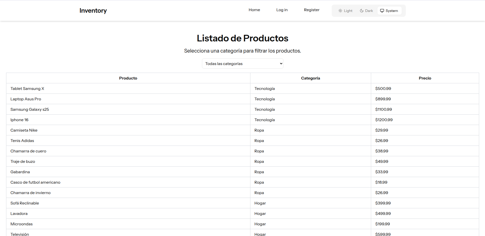
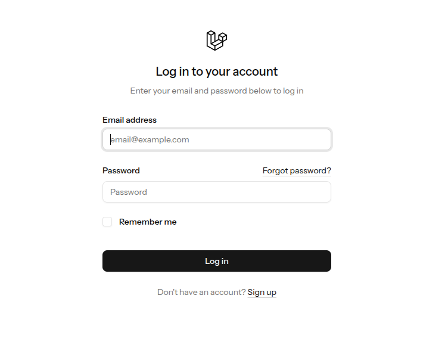
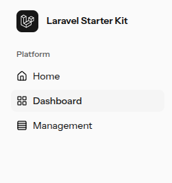
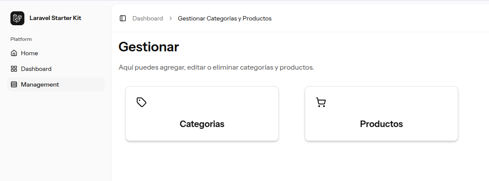
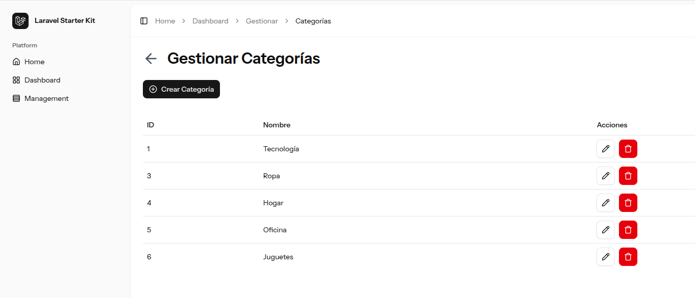
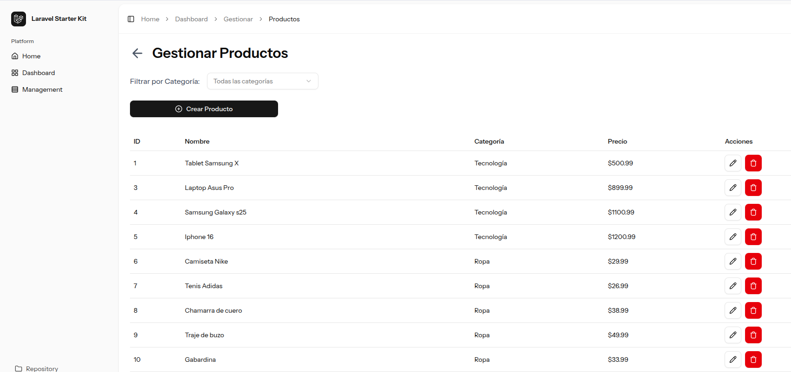
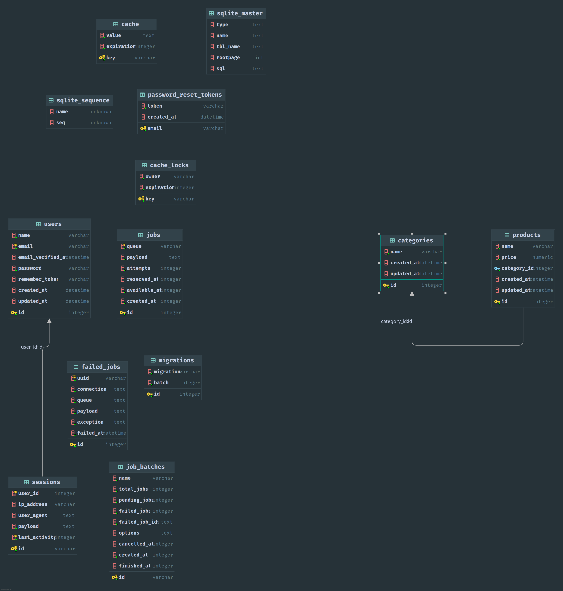

# Inventory
Manejo de inventario con Laravel, React, Tailwind y componentes shadcn ui

# Uso
En la página de inicio se encuentra el primer requerimiento listar productos y categorías.

Para administrar las categorías y los productos hay que iniciar sesión (Las credenciales se entregan por correo).

Al iniciar sesión entrará al dashboard (hay una tabla parecida al inicio, pero no es dinámica son datos en bruto).
Para ver el CRUD de categorías y productos debe entrar a management.

Al entrar verá dos secciones, categorías y productos ahi ya se encuentran las operaciones CRUD y sus respectivas tablas.

Categorías:

Productos:

Finalmente, aquí está el diagrama entidad relación de la Base de datos integrada:

